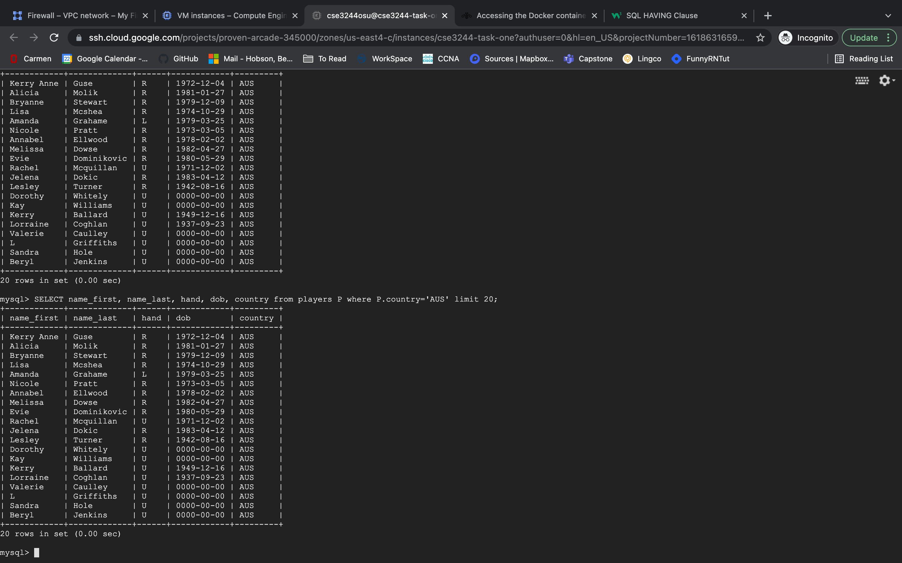
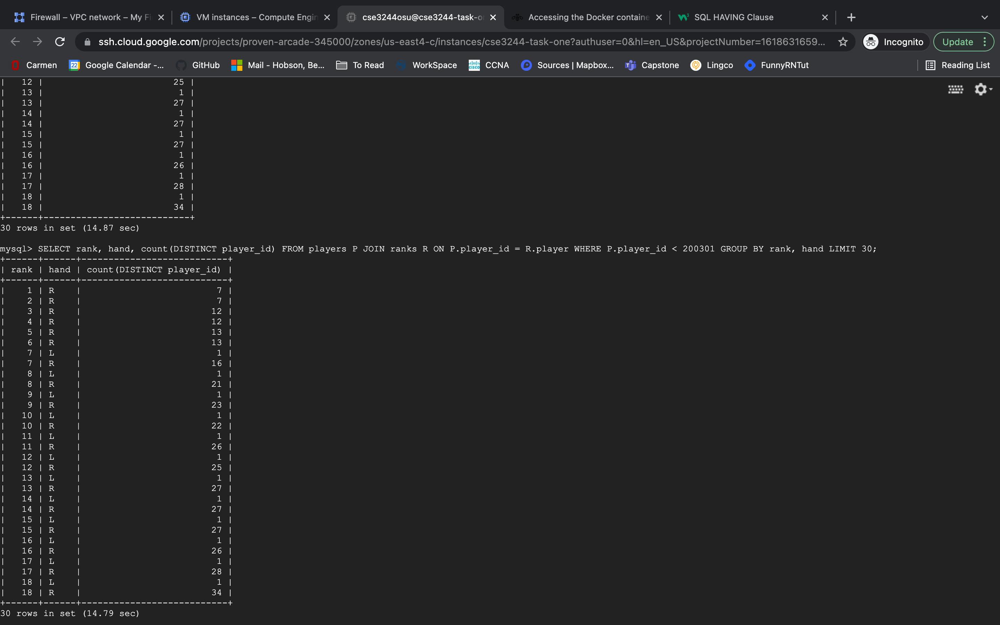
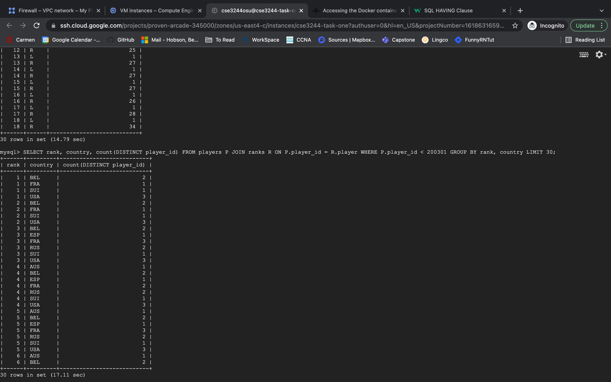
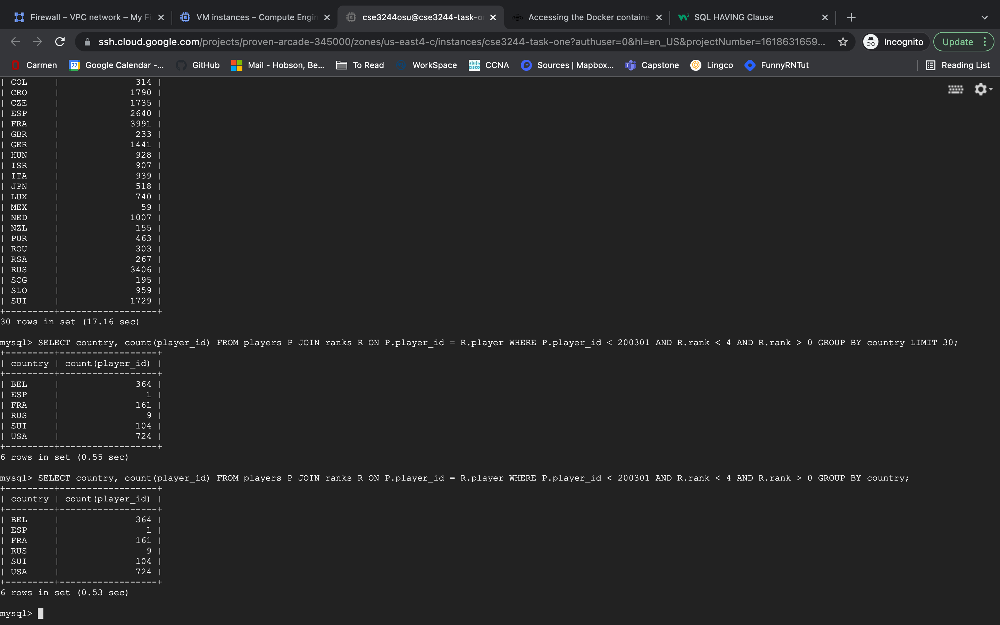
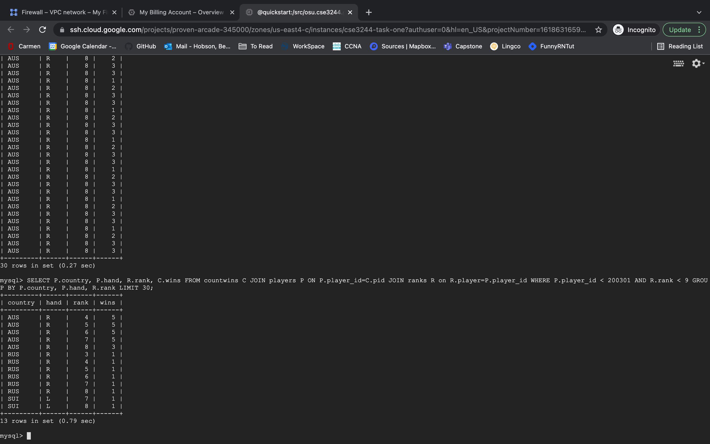

# CSE_3244_Lab

## Overview
This is the lab for CSE 3244 | 25546 Spring 2022. 

## File Tree
```
- README.md
- CSE3244_GCPLab_Overview.pdf
- images
- tasks
    task_one.txt
    task_two.txt
    task_three.txt
    task_four.txt
    task_five.txt
    task_six.txt
    task_seven.txt
    task_eight.txt
```

## Accounts

For this lab a GCP account was made with email cse3244osu@gmail.com and password 3244_osu. This account will be used for GCP.

## Useful commands

To start docker container (if it's not currently running)

```sudo docker run --hostname=quickstart.cloudera --privileged=true -t -i -v /home/cse3244osu/tmp:/src -p 8777:8888 -p 7190:7180 -p 90:80 721d222dcad0 /usr/bin/docker-quickstart -d```

or run 

```dockerun``` since the above command has been aliased in ~/.bashrc

To save mysql state into file

```sudo mysqldump -u root -p tennis > /src/mysql_dump.sql```

## Task One
[Answers](./tasks/task_one.txt)


## Task Two
[Answers](./tasks/task_two.txt)


## Task Three
[Answers](./tasks/task_three.txt)



## Task Four
[Answers](./tasks/task_four.txt)

Task four photo ommited because runtime is too exhaustive and GCP disconnects before screenshot can be taken.

## Task Five
[Answers](./tasks/task_five.txt)



## Task Six
[Answers](./tasks/task_six.txt)



## Task Seven
[Answers](./tasks/task_seven.txt)



## Task Eight
[Answers](./tasks/task_eight.txt)


    
## Authors

- [Benjamin Hobson](mailto:hobson.89@osu.edu)
- Bobby Spech
- Samuel Mahle